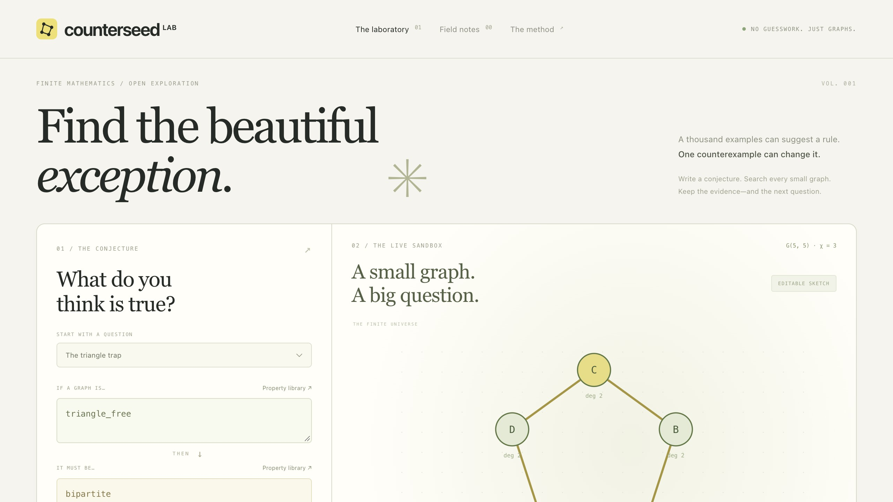
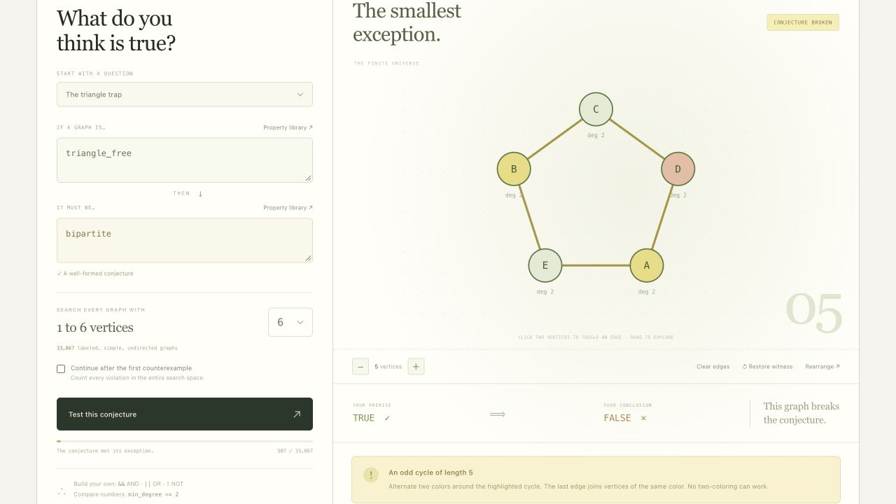
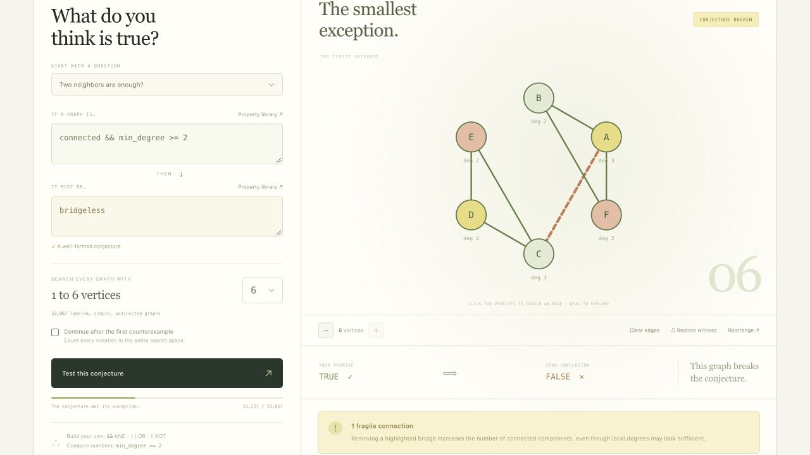
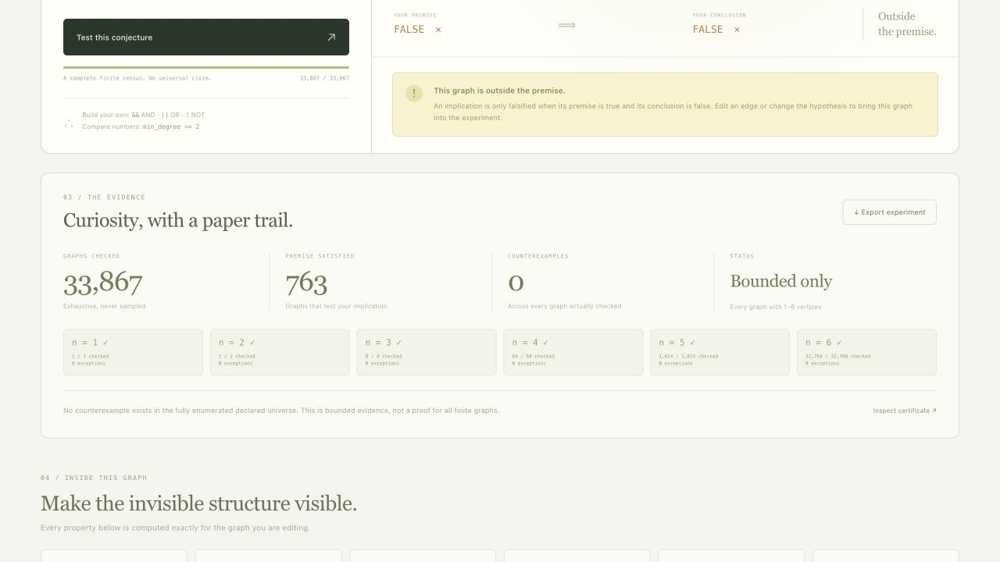

# Counterseed

**Find the beautiful exception.**

A thousand examples can suggest a rule. One counterexample can change it. Counterseed turns a graph-theory conjecture into an experiment you can inspect, edit and reproduce.

Write `triangle_free ⇒ bipartite`. Counterseed searches every smaller simple graph, finds a five-cycle, shows the odd cycle that prevents two-coloring, and lets you remove an edge to see exactly why the result changes.

**[Open the live laboratory](https://toukoursin.github.io/counterseed/)** · [Recorded demo and English captions](https://github.com/ToukoUrsin/counterseed/releases/tag/demo-2026-09-21) · [Demo script](docs/DEMO.md) · [Mathematical conventions](docs/METHOD.md)



Original submission for **Global Innovation Build Challenge V2 — Open / General Technical Invention**. Built during the competition period in September 2026. This project is distinct from the author's other hackathon entries and is not being cross-submitted.

## Try it

The hosted application needs a current browser with module Web Workers. No sign-in, API key, dataset download or paid service is required. Every computation happens in the browser.

To run locally, install Node.js 22 or later:

```sh
git clone https://github.com/ToukoUrsin/counterseed.git
cd counterseed
npm start
# http://127.0.0.1:4322

npm test
node verify.mjs examples/triangle-trap.json
```

There are no npm dependencies and nothing to install. `public/` is a self-contained static site, including the worker; it can be hosted under a subdirectory.

## A real laboratory



- **Build your own implication.** Twenty-four exact graph properties, Boolean logic, parentheses and numeric comparisons. Expressions are parsed into a typed syntax tree; no arbitrary code is executed.
- **Search every small graph.** Enumerate all 33,867 labeled simple undirected graphs on one through six vertices. Stop at the first counterexample or continue for a complete census. The Web Worker reports progress and supports cancellation.
- **Find the smallest witness.** Enumeration orders by vertex count, then edge count, then binary encoding. “Smallest” means those declared criteria, not an unstated aesthetic preference.
- **Make the failure visible.** Inspect an odd cycle, connected components, a bridge, degree sequence or exact coloring. Click two vertices to toggle an edge, click an existing edge to remove it, drag the layout, or use the keyboard-accessible adjacency controls.
- **Own the evidence.** A local notebook stores experiments in your browser. Export the universe, order, counts, witness, property values and enumeration fingerprint. Replay with a separate command-line implementation.

Try these questions:

| Premise | Conclusion | Observed smallest result |
|---|---|---|
| `triangle_free` | `bipartite` | Five-cycle: 5 vertices, 5 edges |
| `no_isolates` | `connected` | Two disjoint edges: 4 vertices, 2 edges |
| `connected` | `traceable` | Three-leaf star: 4 vertices, 3 edges |
| `connected && min_degree >= 2` | `bridgeless` | Two triangles joined by a bridge: 6 vertices, 7 edges |
| `connected && even_degrees` | `eulerian` | No violation among all 33,867 graphs through 6 vertices; bounded evidence only |





## Evidence is not a theorem

A concrete counterexample disproves the universal implication. Passing a finite census does **not** prove it for all graphs. The interface, export and verifier preserve that distinction, including cancelled and vacuous searches.

The six-vertex limit is deliberate: the entire search space can be examined and independently checked in an ordinary browser. Graphs are labeled; isomorphic relabelings are retained. No probabilistic sampling or neural model is involved. The example conjectures are classical teaching examples, not claimed mathematical discoveries.

“Eulerian” includes connectedness here, including the one-vertex empty walk. A Hamiltonian cycle requires at least three vertices. Forests have infinite girth; disconnected graphs have infinite diameter. See [the exact conventions](docs/METHOD.md).

## Verification

`npm test` passed locally: twelve behavioral suites, including all 33,867 graphs checked against independent core-property oracles. All 24 properties are compared on every graph through five vertices and a deterministic six-vertex sample. Tests cover the smallest witnesses, full enumeration, cancellation, safe parsing, editing/encoding and tampered certificates.

The production engine uses adjacency lists, bitsets, BFS/DFS, exact coloring and a constructive Euler walk. The independent reference uses matrices, exhaustive color assignments, permutation paths and separate connectivity routines. It shares the expression parser and enumeration-fingerprint routine, so it is an independent **graph algorithm** check, not a formally verified second implementation of every line.

```sh
node verify.mjs path/to/downloaded-certificate.json
```

The verifier re-enumerates the declared universe and checks counts, minimality, properties and structural witnesses. The fingerprint is noncryptographic and is not a signature. This is a reproducible experiment record, not a formal proof certificate for an unbounded theorem.

Hosted CI is not claimed to pass. The account's GitHub Actions execution was reported blocked by billing; local test evidence is included in [validation notes](docs/VALIDATION.md). GitHub Pages availability is checked separately.

## Built with and credits

- JavaScript ES modules; browser Web Workers, SVG, DOM, Blob and localStorage.
- Node.js standard library and built-in test runner; Git and GitHub Pages.
- Original application, graph engine and independent reference implementation. No third-party runtime library, framework, private dataset, pretrained model or inference API.
- **OpenAI Codex** assisted with concept development, interface, implementation, tests, documentation and demo preparation. The author remains responsible for the submission and its explanations.
- Demo production uses Python/Pillow, FFmpeg and ElevenLabs stock narration. Narration is synthetic, not a cloned personal voice. These services are not needed to run the product.
- Mathematical definitions and standard algorithm background were checked against Princeton's [Algorithms, 4th edition: undirected graphs](https://algs4.cs.princeton.edu/41graph/), [bipartiteness](https://algs4.cs.princeton.edu/code/javadoc/edu/princeton/cs/algs4/Bipartite.html) and [Eulerian cycle](https://algs4.cs.princeton.edu/code/javadoc/edu/princeton/cs/algs4/EulerianCycle.html) references. Their implementation code was not copied.

## Why this exists

Students often encounter graph theory as a catalogue of results. Counterseed makes the failure of a plausible statement something they can discover, manipulate and explain. The invention is the integrated experiment-and-replay experience, not a new graph-theoretic theorem. Educational effectiveness has not been measured in a user study.

MIT licensed. No telemetry, accounts, server-side persistence or external computation. Saved notes are browser-local; export them before clearing site storage.
